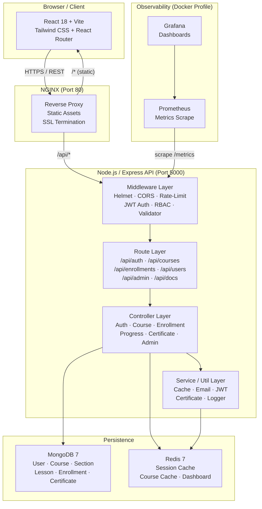
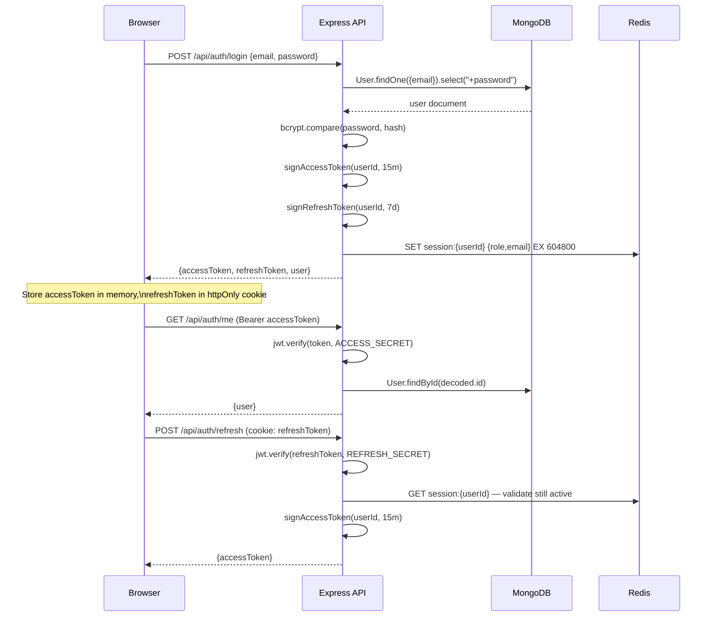
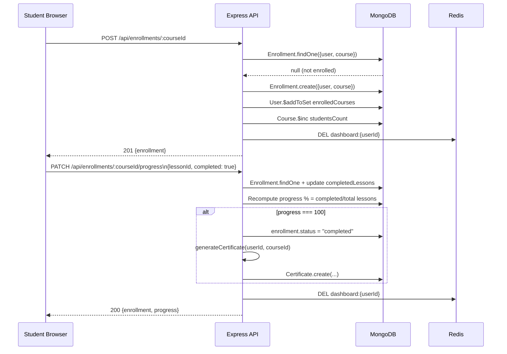
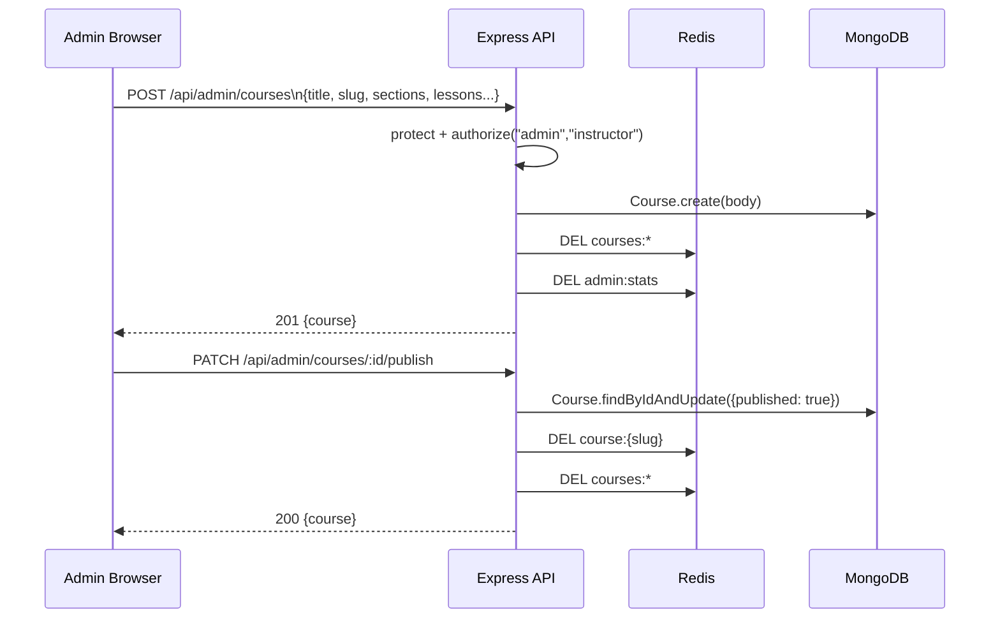

# Design Document: LearnDev Platform — Phase 1

## Overview

LearnDev is a production-ready Online Learning Platform built on a React + Node.js + MongoDB stack.
Phase 1 extends the existing codebase — which already has authentication scaffolding, course CRUD,
enrollment, admin dashboards, Docker Compose, Redis, Prometheus/Grafana, and a GitHub Actions
pipeline — to a fully production-hardened system. The goal is completion and hardening, not rewriting.

The platform supports three roles (Student / Instructor / Admin) and delivers a complete
learn-enroll-progress lifecycle: users browse and enroll in courses composed of
Sections → Lessons, track lesson-level progress, and receive auto-generated completion
certificates. Infrastructure is delivered as a single `docker compose up` command, monitored
with Prometheus + Grafana, logged with Winston (Loki-ready), documented with Swagger/OpenAPI,
and deployed via a gated GitHub Actions pipeline.

---

## Architecture



---

## Sequence Diagrams

### Auth Flow — Login with Refresh Token



### Course Enroll & Progress Flow



### Admin Course Publish Flow



---

## Components and Interfaces

### Component 1: Authentication Service

**Purpose**: Manages registration, login, token issuance, refresh, logout, email verification,
and password reset. Extends the existing `authController.js` with refresh tokens, email flows,
and a dedicated `instructor` role.

**Interface**:
```typescript
interface AuthService {
  register(name: string, email: string, password: string, role?: "student"|"instructor"): Promise<AuthResult>
  login(email: string, password: string): Promise<AuthResult>
  refreshToken(refreshToken: string): Promise<{ accessToken: string }>
  logout(userId: string): Promise<void>
  forgotPassword(email: string): Promise<void>          // sends reset email
  resetPassword(token: string, newPassword: string): Promise<void>
  verifyEmail(token: string): Promise<void>
  getMe(userId: string): Promise<UserProfile>
}

type AuthResult = {
  accessToken: string       // JWT, 15 min expiry
  refreshToken: string      // JWT, 7 day expiry (httpOnly cookie)
  user: UserProfile
}

type UserProfile = {
  id: string
  name: string
  email: string
  role: "student" | "instructor" | "admin"
  avatar: string
  isEmailVerified: boolean
  enrolledCourses: string[]
}
```

**Responsibilities**:
- Hash passwords with bcrypt (rounds=12)
- Issue short-lived access tokens (15 min) + long-lived refresh tokens (7 days)
- Store refresh token reference in Redis (`refreshToken:{userId}`)
- Send transactional email for verification and password reset via Nodemailer
- Invalidate Redis session on logout

---

### Component 2: Course & Content Service

**Purpose**: Full lifecycle management of Courses, Sections, and Lessons. Extends existing
`courseController.js` to add the Section/Lesson hierarchy, instructor ownership, thumbnail upload,
and publish/unpublish workflows.

**Interface**:
```typescript
interface CourseService {
  getCourses(filters: CourseFilters, pagination: Pagination): Promise<PagedResult<Course>>
  getCourseBySlug(slug: string): Promise<CourseWithSections>
  createCourse(data: CreateCourseDTO, instructorId: string): Promise<Course>
  updateCourse(id: string, data: UpdateCourseDTO, requesterId: string): Promise<Course>
  publishCourse(id: string, requesterId: string): Promise<Course>
  deleteCourse(id: string, requesterId: string): Promise<void>
  uploadThumbnail(courseId: string, file: Buffer, mime: string): Promise<string>
  // Sections
  addSection(courseId: string, data: CreateSectionDTO): Promise<Section>
  updateSection(sectionId: string, data: UpdateSectionDTO): Promise<Section>
  deleteSection(sectionId: string): Promise<void>
  // Lessons
  addLesson(sectionId: string, data: CreateLessonDTO): Promise<Lesson>
  updateLesson(lessonId: string, data: UpdateLessonDTO): Promise<Lesson>
  deleteLesson(lessonId: string): Promise<void>
}

type CourseFilters = {
  category?: string; level?: string; search?: string
  featured?: boolean; isFree?: boolean; instructorId?: string
}
```

**Responsibilities**:
- Enforce slug uniqueness
- Cache course list results with 5 min TTL; invalidate on any mutation
- Restrict create/edit/delete to owner instructor or admin
- Manage thumbnail as base64 string or external URL (Phase 1 stores URL or base64; file uploads via multipart are Phase 2)

---

### Component 3: Enrollment & Progress Service

**Purpose**: Manages enrollments, per-lesson completion tracking, progress percentage calculation,
course completion detection, and certificate generation.

**Interface**:
```typescript
interface EnrollmentService {
  enroll(userId: string, courseId: string): Promise<Enrollment>
  getMyEnrollments(userId: string): Promise<EnrollmentWithCourse[]>
  getEnrollmentDetail(userId: string, courseId: string): Promise<EnrollmentDetail>
  markLessonComplete(userId: string, courseId: string, lessonId: string): Promise<ProgressResult>
  markLessonIncomplete(userId: string, courseId: string, lessonId: string): Promise<ProgressResult>
  unenroll(userId: string, courseId: string): Promise<void>
}

type ProgressResult = {
  enrollment: Enrollment
  progressPercent: number          // 0-100
  completedLessons: string[]       // lesson ObjectId strings
  isCompleted: boolean
  certificate?: Certificate        // present when isCompleted becomes true
}
```

**Responsibilities**:
- Prevent duplicate enrollment (unique index on {user, course})
- Compute progress as `(completedLessons.length / totalLessons) * 100` rounded to integer
- Trigger certificate generation when progress reaches 100 for the first time
- Invalidate `dashboard:{userId}` cache on any progress change

---

### Component 4: Certificate Service

**Purpose**: Auto-generates a completion certificate record when a student finishes a course.

**Interface**:
```typescript
interface CertificateService {
  generate(userId: string, courseId: string): Promise<Certificate>
  getByUser(userId: string): Promise<Certificate[]>
  getById(certId: string): Promise<Certificate>
  verify(certId: string): Promise<CertificateVerification>  // public endpoint
}

type Certificate = {
  id: string
  userId: string
  courseId: string
  courseTitle: string
  studentName: string
  issuedAt: Date
  verificationUrl: string          // /api/certificates/:id/verify
}
```

---

### Component 5: Cache Service

**Purpose**: Thin wrapper around ioredis (already in `src/utils/cache.js`) with typed helpers.
Extended to support dashboard-level cache keys and hit-ratio metrics for Prometheus.

**Interface**:
```typescript
interface CacheService {
  get<T>(key: string): Promise<T | null>
  set<T>(key: string, value: T, ttlSeconds?: number): Promise<void>
  del(pattern: string): Promise<void>           // supports glob patterns
  withLock<T>(lockKey: string, fn: () => Promise<T>, ttl?: number): Promise<T>
  incrementHit(): void      // increments prometheus counter
  incrementMiss(): void
}
```

**Cache Key Conventions**:
| Key Pattern | TTL | Invalidated By |
|---|---|---|
| `courses:{filters}:{page}:{limit}` | 300 s | Any course mutation |
| `course:{slug}` | 300 s | Course update/delete |
| `dashboard:{userId}` | 60 s | Enrollment/progress change |
| `admin:stats` | 120 s | User/course/enrollment mutation |
| `stats:platform` | 600 s | Course mutation |
| `popular:courses` | 600 s | Daily scheduled invalidation |
| `session:{userId}` | 604800 s | Logout |

---

### Component 6: Metrics & Monitoring

**Purpose**: Exposes `/metrics` in Prometheus text format for CPU, memory, HTTP request
rate/duration, error rate, and Redis cache hit ratio.

**Interface**:
```typescript
interface MetricsService {
  httpRequestDuration: Histogram    // labels: method, route, status_code
  httpRequestTotal: Counter         // labels: method, route, status_code
  cacheHits: Counter
  cacheMisses: Counter
  activeConnections: Gauge
  dbQueryDuration: Histogram        // labels: operation, collection
}
```

---

## Data Models

### Model 1: User (extend existing)

```typescript
interface User {
  _id: ObjectId
  name: string                              // required, trim
  email: string                             // required, unique, lowercase
  password: string                          // bcrypt hash, select:false
  role: "student" | "instructor" | "admin" // default: "student"
  isBlocked: boolean                        // default: false
  isEmailVerified: boolean                  // default: false
  emailVerificationToken?: string           // hashed, expires
  emailVerificationExpires?: Date
  passwordResetToken?: string               // hashed, 10 min expiry
  passwordResetExpires?: Date
  avatar: string
  bio: string
  enrolledCourses: ObjectId[]               // ref: Course
  createdAt: Date
  updatedAt: Date
}
```

**Changes from existing**: Add `role: "instructor"` to enum (currently only "user"/"admin"),
add `isEmailVerified`, `emailVerificationToken/Expires`, `passwordResetToken/Expires`.
Rename `"user"` → `"student"` in enum (migration required for existing documents).

**Validation Rules**:
- `email`: must pass RFC 5322 format check
- `password`: minimum 6 characters before hashing
- `role`: only assignable by admin or on registration (instructor self-registration allowed)

---

### Model 2: Course (extend existing)

```typescript
interface Course {
  _id: ObjectId
  title: string                    // required, trim
  slug: string                     // required, unique, lowercase, auto-generated
  description: string              // required
  shortDescription: string
  instructorId: ObjectId           // ref: User — NEW (replaces string instructor field)
  instructorName: string           // denormalized for fast reads
  category: CourseCategory
  level: "Beginner" | "Intermediate" | "Advanced"
  price: number                    // default 0
  isFree: boolean
  thumbnail: string                // URL or base64
  duration: string                 // human-readable e.g. "12h 30m"
  totalLessons: number             // computed from sections.lessons.length
  rating: number                   // 0-5
  studentsCount: number
  tags: string[]
  sections: ObjectId[]             // ref: Section — NEW
  featured: boolean
  published: boolean
  publishedAt?: Date               // set when published=true
  createdAt: Date
  updatedAt: Date
}
```

**Changes from existing**: Replace inline `curriculum` array with separate `Section` collection
referenced by `sections[]`. Add `instructorId` ObjectId. Retain `instructor` string for backward
compat during migration.

---

### Model 3: Section (new)

```typescript
interface Section {
  _id: ObjectId
  course: ObjectId                 // ref: Course
  title: string                    // required
  order: number                    // display order, 0-indexed
  lessons: ObjectId[]              // ref: Lesson
  createdAt: Date
  updatedAt: Date
}
```

---

### Model 4: Lesson (new)

```typescript
interface Lesson {
  _id: ObjectId
  section: ObjectId                // ref: Section
  course: ObjectId                 // denormalized ref for fast lookup
  title: string                    // required
  order: number
  type: "video" | "pdf" | "notes" | "resource"
  content: string                  // video URL, PDF URL, or markdown notes
  resourceUrl?: string             // downloadable resource
  duration?: number                // seconds (for video)
  isPreview: boolean               // free preview without enrollment
  createdAt: Date
  updatedAt: Date
}
```

---

### Model 5: Enrollment (extend existing)

```typescript
interface Enrollment {
  _id: ObjectId
  user: ObjectId                   // ref: User
  course: ObjectId                 // ref: Course
  progress: number                 // 0-100, integer
  completedLessons: ObjectId[]     // ref: Lesson — CHANGED from string[]
  status: "active" | "completed" | "dropped"
  enrolledAt: Date
  completedAt?: Date
  lastAccessedAt?: Date            // NEW — for "resume learning"
  lastLessonId?: ObjectId          // NEW — resume pointer
  createdAt: Date
  updatedAt: Date
}
```

**Changes from existing**: `completedLessons` changes from `string[]` to `ObjectId[]` (ref Lesson).
Add `lastAccessedAt` and `lastLessonId` for resume learning.

---

### Model 6: Certificate (new)

```typescript
interface Certificate {
  _id: ObjectId
  user: ObjectId                   // ref: User
  course: ObjectId                 // ref: Course
  courseTitle: string              // denormalized
  studentName: string              // denormalized
  instructorName: string           // denormalized
  issuedAt: Date
  verificationCode: string         // UUID v4, unique — for public verify endpoint
  createdAt: Date
}
```

---

### Model 7: RefreshToken (new)

```typescript
interface RefreshToken {
  _id: ObjectId
  user: ObjectId                   // ref: User
  tokenHash: string                // SHA-256 of the raw JWT
  expiresAt: Date                  // TTL index — auto-purge
  createdAt: Date
}
```

**Index**: `{ expiresAt: 1 }` with `expireAfterSeconds: 0` for automatic MongoDB TTL cleanup.

---

## Algorithmic Pseudocode

### Algorithm 1: Login with Dual-Token Issuance

```pascal
PROCEDURE login(email, password)
  INPUT:  email: String, password: String
  OUTPUT: AuthResult | ErrorResponse

  PRECONDITIONS:
    isValidEmail(email) = true
    password ≠ ""

  POSTCONDITIONS:
    result.accessToken expires in 15 minutes
    result.refreshToken stored as httpOnly cookie
    Redis session:{user._id} is set

  SEQUENCE
    user ← DB.User.findOne({email}).select("+password")

    IF user = NULL THEN
      RETURN Error(401, "Invalid credentials")
    END IF

    IF user.isBlocked = true THEN
      RETURN Error(403, "Account blocked")
    END IF

    IF NOT bcrypt.compare(password, user.password) THEN
      RETURN Error(401, "Invalid credentials")
    END IF

    accessToken  ← jwt.sign({id: user._id, role: user.role}, ACCESS_SECRET,  "15m")
    refreshToken ← jwt.sign({id: user._id},                  REFRESH_SECRET, "7d")
    tokenHash    ← sha256(refreshToken)

    DB.RefreshToken.create({user: user._id, tokenHash, expiresAt: now+7d})
    Redis.setex("session:" + user._id, 604800, {email, role})

    RETURN {accessToken, refreshToken, user: sanitize(user)}
  END SEQUENCE
END PROCEDURE
```

**Loop Invariants**: N/A (no loops)

---

### Algorithm 2: Lesson Progress Update

```pascal
PROCEDURE markLessonComplete(userId, courseId, lessonId)
  INPUT:  userId: ObjectId, courseId: ObjectId, lessonId: ObjectId
  OUTPUT: ProgressResult

  PRECONDITIONS:
    Enrollment exists for (userId, courseId)
    Lesson belongs to courseId
    lessonId NOT already in enrollment.completedLessons

  POSTCONDITIONS:
    lessonId ∈ enrollment.completedLessons
    enrollment.progress = floor((|completedLessons| / totalLessons) * 100)
    IF enrollment.progress = 100 THEN certificate is issued exactly once

  SEQUENCE
    enrollment ← DB.Enrollment.findOne({user: userId, course: courseId})
    IF enrollment = NULL THEN RETURN Error(404, "Not enrolled") END IF

    lesson ← DB.Lesson.findById(lessonId)
    IF lesson = NULL OR lesson.course ≠ courseId THEN
      RETURN Error(400, "Invalid lesson")
    END IF

    IF lessonId IN enrollment.completedLessons THEN
      RETURN {enrollment, progressPercent: enrollment.progress, isCompleted: enrollment.status="completed"}
    END IF

    enrollment.completedLessons.push(lessonId)
    enrollment.lastLessonId    ← lessonId
    enrollment.lastAccessedAt ← now()

    totalLessons ← DB.Lesson.countDocuments({course: courseId})
    newProgress  ← floor((enrollment.completedLessons.length / totalLessons) * 100)
    enrollment.progress ← min(newProgress, 100)

    IF enrollment.progress ≥ 100 AND enrollment.status ≠ "completed" THEN
      enrollment.status      ← "completed"
      enrollment.completedAt ← now()
      certificate ← CertificateService.generate(userId, courseId)
    END IF

    DB.save(enrollment)
    Redis.del("dashboard:" + userId)

    RETURN {enrollment, progressPercent: enrollment.progress, isCompleted: enrollment.status="completed", certificate}
  END SEQUENCE
END PROCEDURE
```

**Loop Invariants**: N/A

---

### Algorithm 3: Paginated Course Search with Cache

```pascal
PROCEDURE getCourses(filters, page, limit)
  INPUT:  filters: {category?, level?, search?, featured?, isFree?}
          page: Integer ≥ 1, limit: Integer 1..50
  OUTPUT: PagedResult<Course>

  PRECONDITIONS:
    page ≥ 1
    1 ≤ limit ≤ 50

  POSTCONDITIONS:
    result.courses ⊆ published courses matching filters
    result.total = count of all matching published courses
    result.pages = ceil(total / limit)

  SEQUENCE
    cacheKey ← buildCacheKey("courses", filters, page, limit)
    cached   ← Redis.get(cacheKey)
    IF cached ≠ NULL THEN RETURN {...cached, cached: true} END IF

    mongoFilter ← {published: true}
    IF filters.category  THEN mongoFilter.category  ← filters.category  END IF
    IF filters.level     THEN mongoFilter.level     ← filters.level     END IF
    IF filters.isFree    THEN mongoFilter.isFree    ← true              END IF
    IF filters.featured  THEN mongoFilter.featured  ← true              END IF
    IF filters.search    THEN mongoFilter.$text     ← {$search: filters.search} END IF

    skip ← (page - 1) * limit
    [courses, total] ← Promise.all([
      DB.Course.find(mongoFilter).sort({createdAt: -1}).skip(skip).limit(limit),
      DB.Course.countDocuments(mongoFilter)
    ])

    result ← {courses, total, page, pages: ceil(total/limit)}
    Redis.setex(cacheKey, 300, result)
    RETURN result
  END SEQUENCE
END PROCEDURE
```

---

### Algorithm 4: Refresh Token Rotation

```pascal
PROCEDURE refreshAccessToken(rawRefreshToken)
  INPUT:  rawRefreshToken: String (from httpOnly cookie)
  OUTPUT: {accessToken: String}

  PRECONDITIONS:
    rawRefreshToken is a signed JWT
    Corresponding RefreshToken document exists and is not expired

  POSTCONDITIONS:
    Old RefreshToken document is deleted (rotation)
    New RefreshToken document is created
    Redis session remains valid

  SEQUENCE
    payload ← jwt.verify(rawRefreshToken, REFRESH_SECRET)
    IF verification fails THEN RETURN Error(401, "Invalid refresh token") END IF

    tokenHash ← sha256(rawRefreshToken)
    storedToken ← DB.RefreshToken.findOne({user: payload.id, tokenHash})

    IF storedToken = NULL THEN
      // Possible token reuse — revoke all user tokens
      DB.RefreshToken.deleteMany({user: payload.id})
      Redis.del("session:" + payload.id)
      RETURN Error(401, "Refresh token reuse detected")
    END IF

    IF storedToken.expiresAt < now() THEN
      DB.RefreshToken.deleteOne({_id: storedToken._id})
      RETURN Error(401, "Refresh token expired")
    END IF

    // Rotate: delete old, issue new
    DB.RefreshToken.deleteOne({_id: storedToken._id})
    user ← DB.User.findById(payload.id)
    newAccessToken  ← jwt.sign({id: user._id, role: user.role}, ACCESS_SECRET, "15m")
    newRefreshToken ← jwt.sign({id: user._id}, REFRESH_SECRET, "7d")
    DB.RefreshToken.create({user: user._id, tokenHash: sha256(newRefreshToken), expiresAt: now+7d})

    RETURN {accessToken: newAccessToken, newRefreshToken}
  END SEQUENCE
END PROCEDURE
```

---

## Key Functions with Formal Specifications

### Backend — Auth Controller

```javascript
// POST /api/auth/register
register(req, res, next)
// Preconditions:  req.body.name non-empty, email valid RFC format,
//                 password.length >= 6, email not already registered
// Postconditions: User created with hashed password, accessToken + refreshToken returned,
//                 verification email sent, status 201

// POST /api/auth/login
login(req, res, next)
// Preconditions:  email valid, password non-empty
// Postconditions: Returns {accessToken, refreshToken} if credentials valid;
//                 Redis session set; blocked users receive 403

// POST /api/auth/refresh
refreshToken(req, res, next)
// Preconditions:  cookies.refreshToken present and valid JWT, matching DB record
// Postconditions: Old token deleted, new tokens issued (rotation), status 200

// POST /api/auth/forgot-password
forgotPassword(req, res, next)
// Preconditions:  email is registered
// Postconditions: Hashed reset token stored with 10 min expiry, email sent;
//                 always returns 200 (no account enumeration)

// PATCH /api/auth/reset-password/:token
resetPassword(req, res, next)
// Preconditions:  token valid and not expired, newPassword.length >= 6
// Postconditions: Password updated and hashed, all refresh tokens for user deleted
```

### Backend — Course Controller

```javascript
// POST /api/courses (instructor or admin)
createCourse(req, res, next)
// Preconditions:  user.role in ["instructor","admin"], body has title/slug/description/category
// Postconditions: Course created with instructorId = req.user._id,
//                 published=false by default, course list cache invalidated

// PATCH /api/courses/:id/publish (instructor owns or admin)
publishCourse(req, res, next)
// Preconditions:  Course has ≥1 section with ≥1 lesson, thumbnail present
// Postconditions: course.published=true, course.publishedAt=now, caches invalidated

// GET /api/courses (public)
getCourses(req, res, next)
// Preconditions:  page ≥ 1, limit ∈ [1,50]
// Postconditions: Returns paginated published courses matching filters;
//                 result served from cache when cache hit
```

### Backend — Enrollment Controller

```javascript
// POST /api/enrollments/:courseId
enroll(req, res, next)
// Preconditions:  user authenticated, course exists and is published,
//                 user not already enrolled
// Postconditions: Enrollment created, studentsCount+1, enrolledCourses updated,
//                 dashboard cache invalidated, status 201

// PATCH /api/enrollments/:courseId/progress
updateProgress(req, res, next)
// Preconditions:  enrollment exists, lessonId belongs to courseId
// Postconditions: completedLessons updated, progress% recomputed,
//                 certificate generated if progress=100 for first time
```

### Frontend — Key Hooks

```typescript
// src/hooks/useAuth.ts
function useAuth(): {
  user: UserProfile | null
  login: (email: string, password: string) => Promise<void>
  logout: () => Promise<void>
  register: (name: string, email: string, password: string, role?: string) => Promise<void>
  isLoading: boolean
}
// Postconditions: accessToken stored in memory (not localStorage),
//                 auto-refresh triggered 60s before expiry via silent refresh

// src/hooks/useCourses.ts
function useCourses(filters: CourseFilters): {
  courses: Course[]
  total: number
  pages: number
  isLoading: boolean
  error: string | null
  refetch: () => void
}

// src/hooks/useProgress.ts
function useProgress(courseId: string): {
  enrollment: Enrollment | null
  markComplete: (lessonId: string) => Promise<void>
  markIncomplete: (lessonId: string) => Promise<void>
  progressPercent: number
  resumeLesson: Lesson | null
}
```

---

## Example Usage

### Enrolling and resuming a course (frontend)

```javascript
// In CourseDetail page
const { user } = useAuth()
const { enrollment, markComplete, progressPercent, resumeLesson } = useProgress(course._id)

// Enroll button handler
async function handleEnroll() {
  await axios.post(`/api/enrollments/${course._id}`)
  toast.success("Enrolled successfully!")
  navigate(`/learn/${course.slug}`)
}

// Lesson player — mark complete
async function handleLessonDone(lessonId) {
  const result = await markComplete(lessonId)
  if (result.isCompleted) {
    toast.success("Course completed! Your certificate is ready.")
    navigate(`/certificates/${result.certificate.id}`)
  }
}

// Resume learning
if (resumeLesson) {
  navigate(`/learn/${course.slug}/lessons/${resumeLesson._id}`)
}
```

### Instructor creating a course (frontend)

```javascript
// POST /api/courses
const course = await axios.post("/api/courses", {
  title: "Advanced Node.js Patterns",
  slug: "advanced-nodejs-patterns",
  description: "Deep dive into Node.js internals...",
  shortDescription: "Master event loop, streams, and clustering",
  category: "Programming",
  level: "Advanced",
  price: 49.99,
  isFree: false,
})

// Add a section
const section = await axios.post(`/api/courses/${course.data.course._id}/sections`, {
  title: "Event Loop Deep Dive",
  order: 0,
})

// Add a lesson to section
await axios.post(`/api/sections/${section.data.section._id}/lessons`, {
  title: "How the Event Loop Works",
  type: "video",
  content: "https://cdn.learndev.io/videos/event-loop.mp4",
  duration: 1820,   // seconds
  order: 0,
})

// Publish when ready
await axios.patch(`/api/courses/${course.data.course._id}/publish`)
```

### Prometheus metrics endpoint setup (backend)

```javascript
// src/config/metrics.js
const client = require("prom-client")
const register = new client.Registry()
client.collectDefaultMetrics({ register })

const httpDuration = new client.Histogram({
  name: "http_request_duration_seconds",
  help: "Duration of HTTP requests in seconds",
  labelNames: ["method", "route", "status_code"],
  buckets: [0.005, 0.01, 0.05, 0.1, 0.5, 1, 2, 5],
  registers: [register],
})

const cacheHits   = new client.Counter({ name: "redis_cache_hits_total",   help: "Redis cache hits",   registers: [register] })
const cacheMisses = new client.Counter({ name: "redis_cache_misses_total",  help: "Redis cache misses", registers: [register] })

// Express route
app.get("/metrics", async (_req, res) => {
  res.set("Content-Type", register.contentType)
  res.end(await register.metrics())
})
```

---

## Correctness Properties

These are system invariants that must hold at all times and form the basis for property-based tests.

### Property 1: Progress Monotonicity

A lesson, once marked complete, never decreases the progress percentage.

`∀ enrollment: markComplete(lesson) ⟹ newProgress ≥ oldProgress`

**Validates: Requirements 4.1**

### Property 2: Progress Bounds

Progress is always in the closed interval [0, 100].

`∀ enrollment: 0 ≤ enrollment.progress ≤ 100`

**Validates: Requirements 4.1**

### Property 3: Certificate Uniqueness

At most one certificate is issued per (user, course) pair.

`∀ (userId, courseId): |Certificate.find({user:userId, course:courseId})| ≤ 1`

**Validates: Requirements 4.4**

### Property 4: Certificate Iff Completion

A certificate exists if and only if the enrollment status is "completed".

`∀ enrollment: enrollment.status="completed" ⟺ Certificate exists for (enrollment.user, enrollment.course)`

**Validates: Requirements 4.4**

### Property 5: Enrollment Uniqueness

A user cannot be enrolled in the same course twice.

`∀ (userId, courseId): |Enrollment.find({user,course})| ≤ 1`

**Validates: Requirements 2.1**

### Property 6: Token Freshness

An access token is always accepted within its 15-minute window and rejected after expiry.

`∀ accessToken: verifyToken(t, now+15m+1s) = REJECTED`

**Validates: Requirements 1.1**

### Property 7: Refresh Token Rotation

Using a refresh token invalidates it; reuse is detected and triggers full revocation.

`∀ refreshToken: use(t) ⟹ t is deleted; reuse(t) after use ⟹ all user tokens revoked`

**Validates: Requirements 1.1**

### Property 8: RBAC Invariant

Only admin/instructor users can mutate courses; only enrolled students can update lesson progress.

`∀ mutation ∈ {createCourse,updateCourse,deleteCourse}: user.role ∈ {"admin","instructor"}`

**Validates: Requirements 1.3**

### Property 9: Cache Consistency

Cached course data is never served after a mutation; the cache is always invalidated.

`∀ mutation m on course C: getCourse(C.slug) after m returns non-cached, fresh data`

**Validates: Requirements 6.1**

### Property 10: Password Hashing

Plaintext passwords are never stored; hash round count is always ≥ 12.

`∀ user: user.password ≠ plaintext ∧ bcrypt.getRounds(user.password) ≥ 12`

**Validates: Requirements 9.1**

---

## Error Handling

### Scenario 1: Duplicate Enrollment

**Condition**: `POST /api/enrollments/:courseId` when enrollment already exists (unique index violation or explicit check)
**Response**: `400 { success: false, message: "Already enrolled" }`
**Recovery**: Frontend shows toast "You are already enrolled in this course" and navigates to `/learn/:slug`

### Scenario 2: Expired Access Token

**Condition**: JWT verification throws `TokenExpiredError`
**Response**: `401 { success: false, message: "Token expired" }`
**Recovery**: Frontend Axios interceptor catches 401, calls `POST /api/auth/refresh` with httpOnly cookie,
retries original request with new access token; if refresh also fails, redirects to `/login`

### Scenario 3: Invalid/Reused Refresh Token

**Condition**: Refresh token not found in DB or SHA-256 hash mismatch
**Response**: `401 { success: false, message: "Refresh token reuse detected" }` — all user tokens revoked
**Recovery**: All active sessions forced to re-login; frontend clears auth state and redirects to `/login`

### Scenario 4: Course Not Found

**Condition**: `Course.findOne({slug, published:true})` returns null
**Response**: `404 { success: false, message: "Course not found" }`
**Recovery**: Frontend renders `<NotFoundPage />` component with "Browse courses" CTA

### Scenario 5: Redis Unavailable

**Condition**: Redis connection fails on startup or operation
**Response**: Operations degrade gracefully — cache functions return null/no-op (already implemented in `cache.js`)
**Recovery**: All reads hit MongoDB directly; no user-facing errors; alert fires via Prometheus `redis_cache_misses_total` spike

### Scenario 6: Rate Limit Exceeded

**Condition**: Client sends more than 100 requests per 15-minute window to `/api/*`
**Response**: `429 { success: false, message: "Too many requests" }` with `Retry-After` header
**Recovery**: Client shows "Too many requests, please wait" toast; auto-retry after delay

### Scenario 7: MongoDB Validation Error

**Condition**: Mongoose schema validation fails (e.g., missing required field, invalid enum)
**Response**: `400 { success: false, message: "<field>: <validation message>" }` (via existing `errorHandler.js`)
**Recovery**: Frontend displays field-level validation errors from response

### Scenario 8: Blocked User Login

**Condition**: `user.isBlocked = true` on login
**Response**: `403 { success: false, message: "Account has been blocked" }`
**Recovery**: Frontend displays "Your account has been suspended. Contact support." and blocks access

---

## Testing Strategy

### Unit Testing Approach

Framework: **Jest** + **Supertest** (to be added to `backend/package.json` as devDependencies).

Test files placed in `backend/src/__tests__/` mirroring the `src/` structure.

Key unit test targets:
- `authController`: register, login, refresh, forgot-password, reset-password — all happy paths and failure branches
- `enrollmentController`: enroll, updateProgress, progress computation, certificate trigger
- `courseController`: getCourses (cache hit vs miss), createCourse, updateCourse, deleteCourse
- `middleware/auth`: protect (valid token, expired token, missing token), authorize (role match/mismatch)
- `utils/cache`: getCache, setCache, deleteCache, withLock (lock acquisition and release)

### Property-Based Testing Approach

**Property Test Library**: `fast-check` (npm install --save-dev fast-check)

Properties to test:
1. Progress is always in [0,100] for any arbitrary set of completed lessons
2. Progress is monotonically non-decreasing as more lessons are completed
3. `buildCacheKey(filters, page, limit)` produces a unique key for every distinct input combination
4. `generateSlug(title)` always produces a lowercase, URL-safe, non-empty string
5. JWT token issued for any user ID is verifiable by the same secret and expires correctly

### Integration Testing Approach

End-to-end API test flows using Jest + Supertest against an in-memory MongoDB (via `mongodb-memory-server`):

1. **Auth Flow**: register → login → getMe → refresh → logout
2. **Enrollment Flow**: login as student → enroll → mark lessons complete → verify progress → check certificate
3. **Instructor Flow**: login as instructor → create course → add sections/lessons → publish
4. **Admin Flow**: login as admin → get stats → block user → delete course

CI integration: tests run in the `build-and-test` job before Docker build (requires adding `npm test` step to `ci-cd.yml`).

---

## Performance Considerations

- **Redis caching** at 5-minute TTL for course lists and 1-minute TTL for dashboards eliminates
  repeated MongoDB aggregations under read-heavy load
- **MongoDB indexes**: text index on `{title, description}` (existing), compound index on
  `{user, course}` for enrollment lookups, single-field index on `{course}` for lesson queries,
  TTL index on `RefreshToken.expiresAt`
- **Pagination**: all list endpoints default to `limit=12`, max `limit=50` to prevent unbounded queries
- **N+1 prevention**: admin user list uses `Promise.all` for enrollment counts (existing); migrate to
  aggregation pipeline for scale (`$lookup` on User → Enrollment)
- **Prometheus histograms**: `http_request_duration_seconds` with buckets aligned to SLO targets
  (p95 < 500ms for course list, p99 < 2s for all endpoints)
- **Connection pooling**: Mongoose defaults (5 connections); tunable via `MONGODB_POOL_SIZE` env var
- **gzip compression**: add `compression` middleware to Express for API responses > 1KB

---

## Security Considerations

- **Helmet** (existing): CSP, X-Frame-Options, HSTS headers
- **Rate limiting** (existing): 100 req/15 min per IP on `/api/*`; tighten auth routes to 10 req/15 min
- **JWT dual-token**: short-lived access tokens (15 min) minimize exposure window; httpOnly cookie for refresh token prevents XSS theft
- **Refresh token rotation**: re-use detection with full revocation prevents stolen-token replay attacks
- **Password reset tokens**: hashed with SHA-256 before storage; 10-minute expiry; single-use
- **Email verification tokens**: same hashing strategy as password reset
- **Input validation**: `express-validator` on all mutating endpoints (existing `validate.js` middleware)
- **CORS**: explicit origin whitelist from `CORS_ORIGIN` env var; no wildcard in production
- **Environment variables**: all secrets in `.env` files; `.env` in `.gitignore`; Docker Compose reads from shell env
- **Admin self-protection**: admin cannot delete or block their own account (existing guards retained)
- **bcrypt rounds**: 12 (existing) — sufficient for production; do not reduce

---

## Dependencies

### New Backend Dependencies to Add

| Package | Version | Purpose |
|---|---|---|
| `nodemailer` | `^6.9.x` | Transactional email (password reset, verification) |
| `crypto` | built-in | SHA-256 for token hashing |
| `uuid` | `^9.x` | Certificate verification codes |
| `prom-client` | `^15.x` | Prometheus metrics |
| `compression` | `^1.7.x` | gzip response compression |
| `swagger-jsdoc` | `^6.x` | OpenAPI spec generation from JSDoc |
| `swagger-ui-express` | `^5.x` | Serve Swagger UI at `/api/docs` |
| `jest` | `^29.x` | Test runner (devDependency) |
| `supertest` | `^7.x` | HTTP integration tests (devDependency) |
| `mongodb-memory-server` | `^10.x` | In-memory MongoDB for tests (devDependency) |
| `fast-check` | `^3.x` | Property-based testing (devDependency) |

### New Frontend Dependencies to Add

| Package | Version | Purpose |
|---|---|---|
| `react-player` | `^2.x` | Embedded video lesson player |
| `react-pdf` | `^7.x` | In-browser PDF lesson viewer |
| `react-markdown` | `^9.x` | Render markdown lesson notes |
| `@uiw/react-md-editor` | `^3.x` | Markdown editor for instructor notes |

### Existing Dependencies (retained, no change)

Backend: `express`, `mongoose`, `jsonwebtoken`, `bcryptjs`, `ioredis`, `express-validator`,
`helmet`, `cors`, `express-rate-limit`, `morgan`, `winston`, `dotenv`

Frontend: `react`, `react-router-dom`, `axios`, `tailwindcss`, `react-hot-toast`,
`lucide-react`, `framer-motion`, `recharts`

Infrastructure: `mongo:7`, `redis:7-alpine`, `nginx:alpine`, `prom/prometheus:v2.53.0`,
`grafana/grafana:11.1.0`
